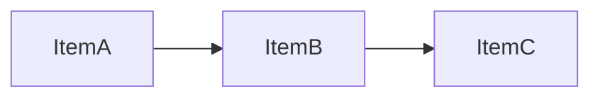
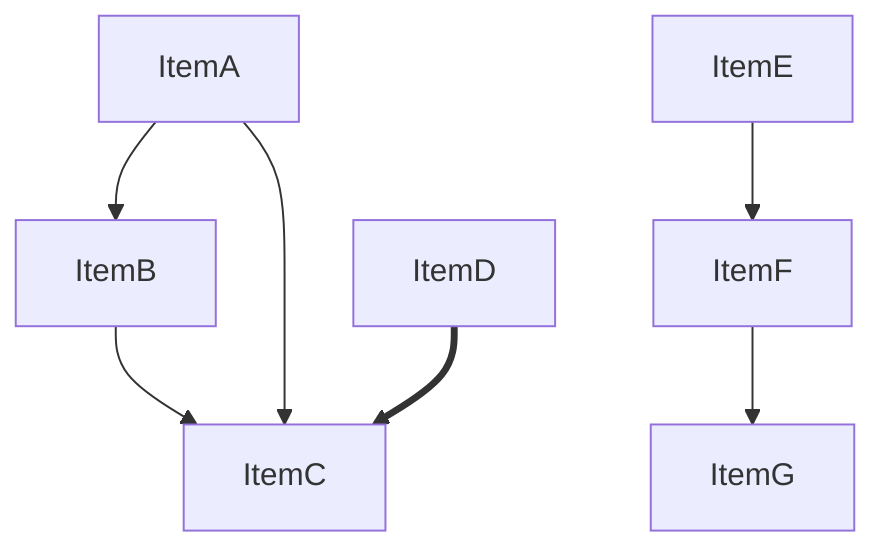
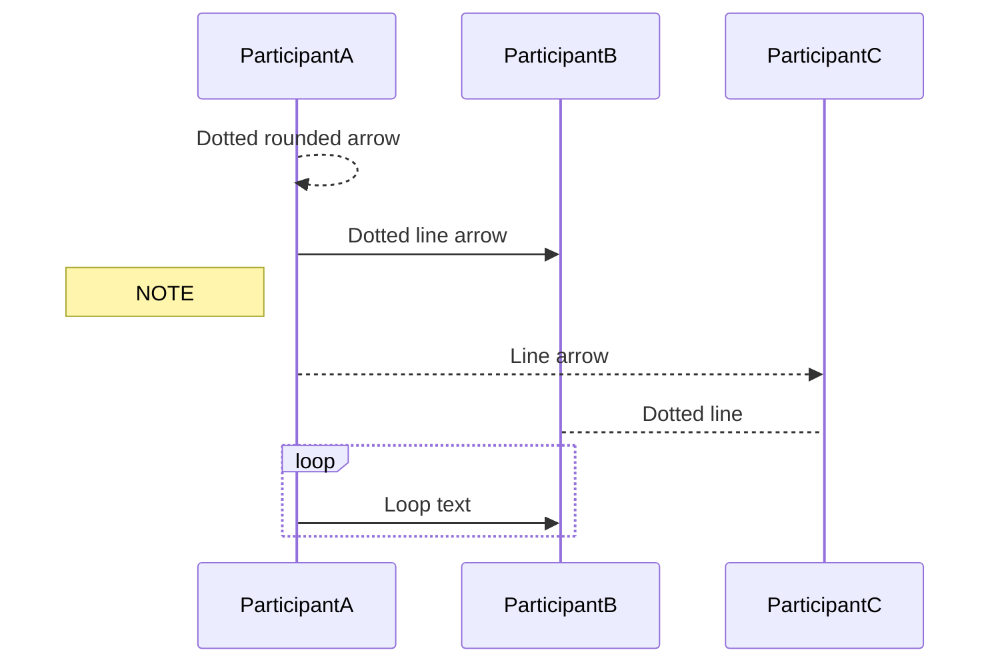
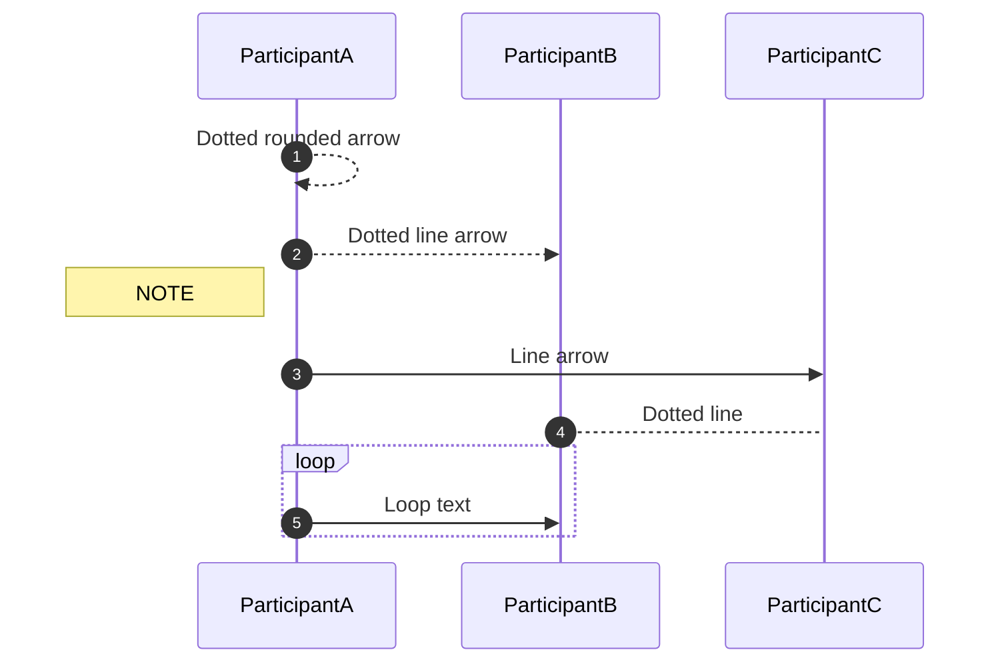
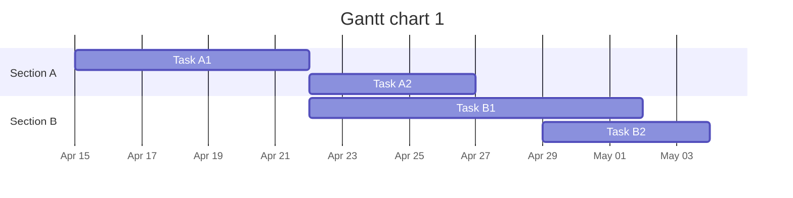
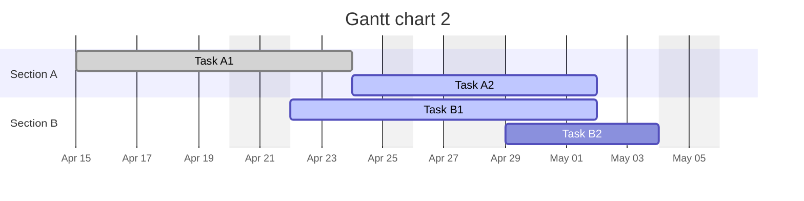

# Mermaid chart examples

## Flow chart

```mermaid
flowchart LR
    ItemA-->ItemB-->ItemC
```

```mermaid
graph TB
    A[ItemA]-->B[ItemB]-->C[ItemC]
    A-->C
    D[ItemD]==>C
    E[ItemE]-->F[ItemF]-->G[ItemG]
```

## Sequence chart

```mermaid
sequenceDiagram
    ParticipantA-->>ParticipantA: Dotted rounded arrow
    ParticipantA->>ParticipantB: Dotted line arrow
    Note left of ParticipantA: NOTE
    ParticipantA-->>ParticipantC: Line arrow
    ParticipantB-->ParticipantC: Dotted line
    loop
        ParticipantA->>ParticipantB: Loop text
    end
```
### Use alias and autonumber

```mermaid
sequenceDiagram
    autonumber
    participant A as ParticipantA
    participant B as ParticipantB
    participant C as ParticipantC
    A-->>A: Dotted rounded arrow
    A-->>B: Dotted line arrow
    Note left of A: NOTE
    A->>C: Line arrow
    B-->C: Dotted line
    loop
        A->>B: Loop text
    end
```

## Gantt chart

```mermaid
gantt 
    title Gantt chart 1
    dateFormat YYYY-MM-DD
    axisFormat %b %d
    section Section A
        Task A1: a1, 2024-04-15, 7d
        Task A2: after a1, 5d
    section Section B
        Task B1: 2024-04-22, 2024-05-02
        Task B2: 2024-04-29, 5d
```

```mermaid
gantt 
    title Gantt chart 2
    dateFormat YYYY-MM-DD
    axisFormat %b %d
    excludes weekends 2024-04-25
    section Section A
        Task A1: done, a1, 2024-04-15, 7d
        Task A2: active, after a1, 5d
    section Section B
        Task B1: active, 2024-04-22, 2024-05-02
        Task B2: 2024-04-29, 5d
```

