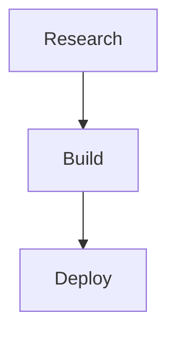
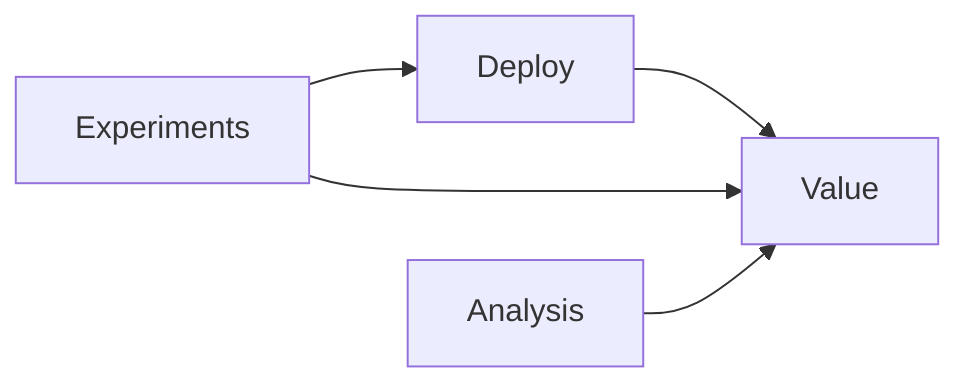
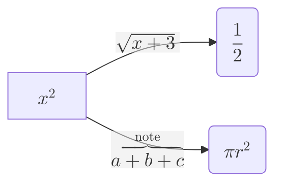
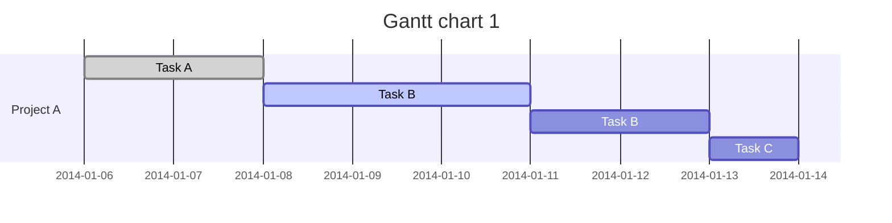

# Mermaid chart examples

## Flow chart

```mermaid
flowchart 
    Research-->Build-->Deploy
```

```mermaid
graph LR
    A[Experiments]-->B[Deploy]-->C[Value]
    A-->C
    D[Analysis]-->C
```

```mermaid
graph LR
    A["$$x^2$$"] -->|"$$\sqrt{x+3}$$"| B("$$\frac{1}{2}$$")
    A -->|"$$\overbrace{a+b+c}^{\text{note}}$$"| C("$$\pi r^2$$")
```

## Gantt chart

```mermaid
gantt
    title Gantt chart 1
    dateFormat YYYY-MM-DD
    section Project A
    Task A: done, task1, 2014-01-06,2014-01-08
    Task B:active,  task2, after task1, 3d
    Task B: task3, after task2, 2d
    Task C: task4, after task3, 1d
```

```mermaid
gantt
    title Gantt chart 1
    dateFormat YYYY-MM-DD
    section Project A
    Task A: done, task1, 2014-01-06,2014-01-08
    Task B:active,  task2, after task1, 3d
    Task B: task3, after task2, 2d
    Task C: task4, after task3, 1d
```