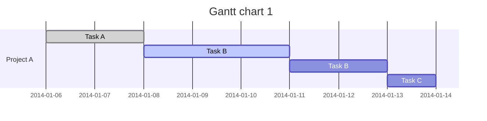

# Mermaid chart examples

## Gantt chart

```mermaid
gantt
    title Gantt chart 1
    dateFormat YYYY-MM-DD
    section Project A
    Task A: done, task1, 2014-01-06,2014-01-08
    Task B:active,  task2, after task1, 3d
    Task B: task3, after task2, 2d
    Task C: task4, after task3, 1d
```