# Mermaid chart examples

## Flow chart
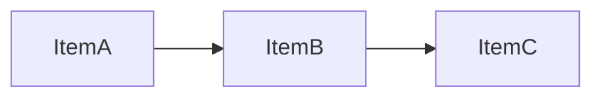

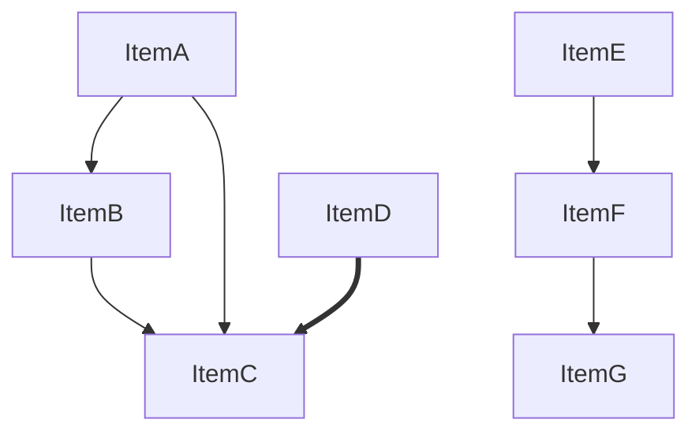

## Sequence chart
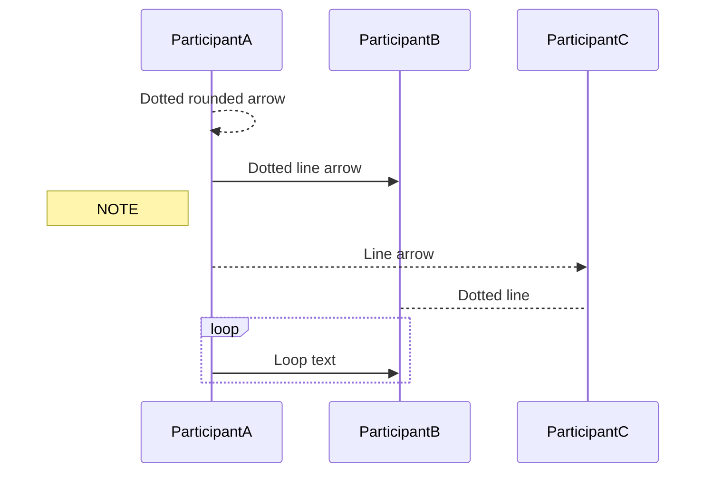
### Use alias and autonumber

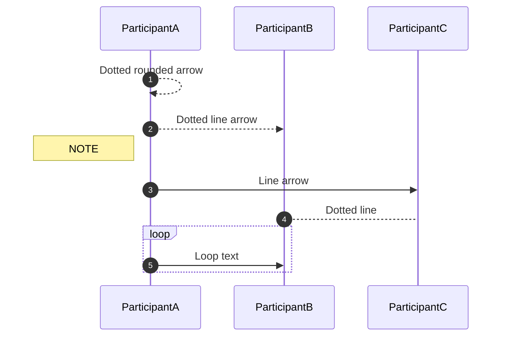

## Timeline
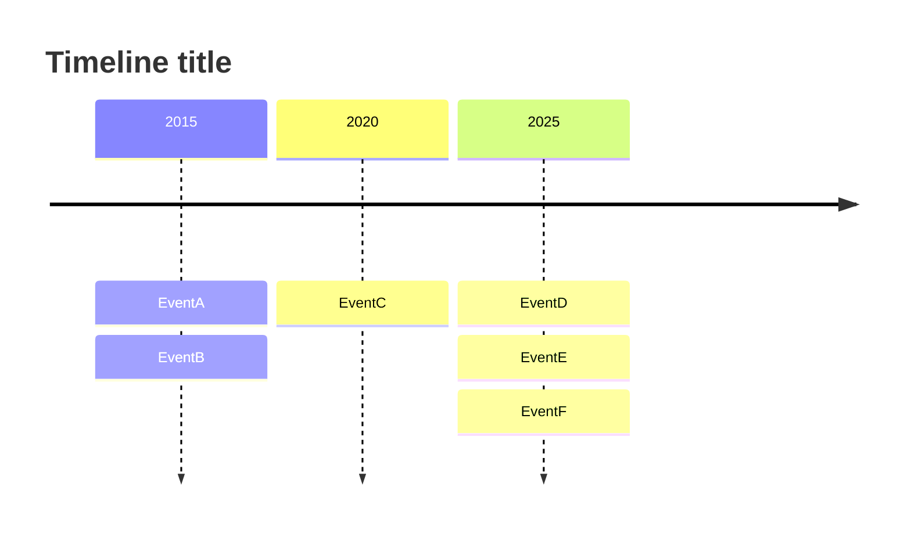

## Gantt chart
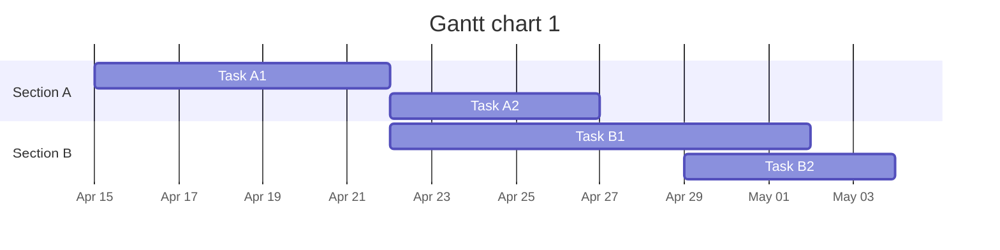

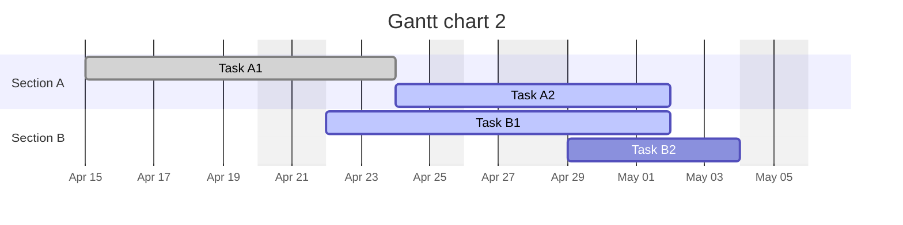

## Class chart
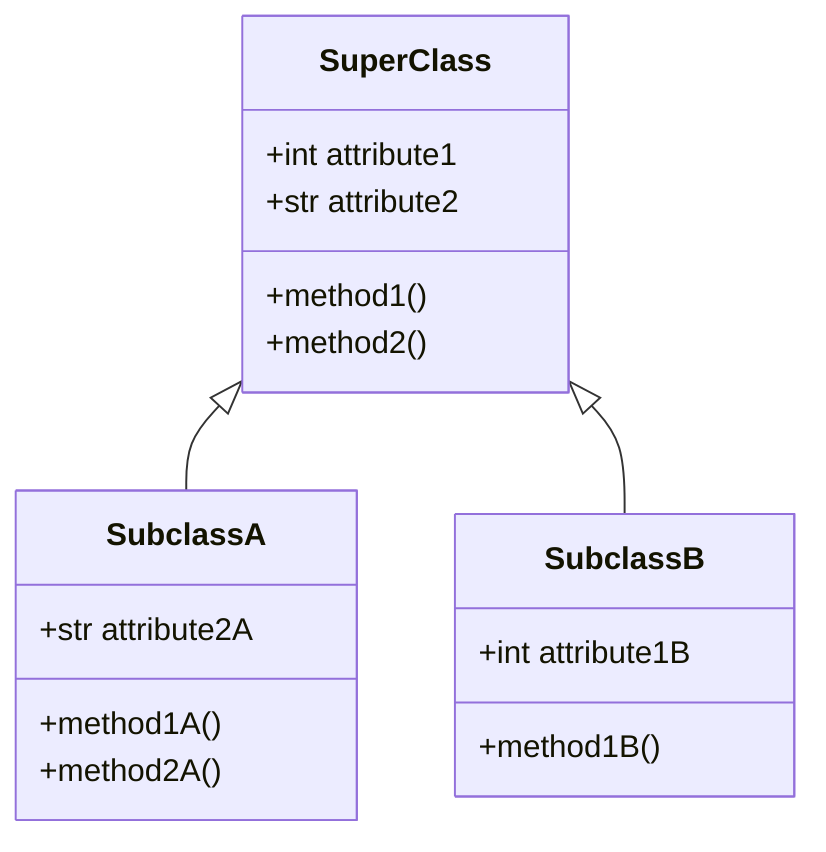

## Mindmap
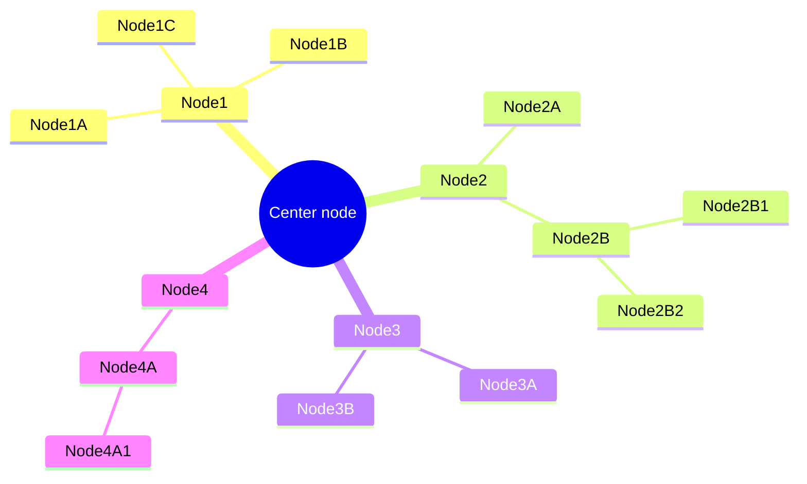

## Distribution chart
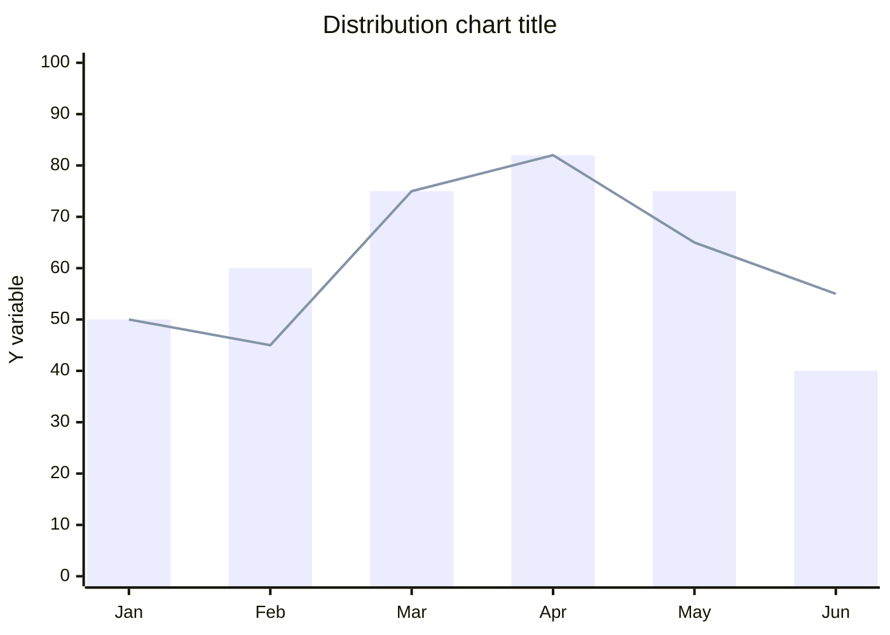

## State diagram
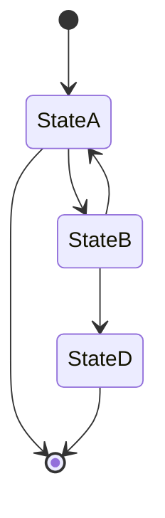

## Pie chart
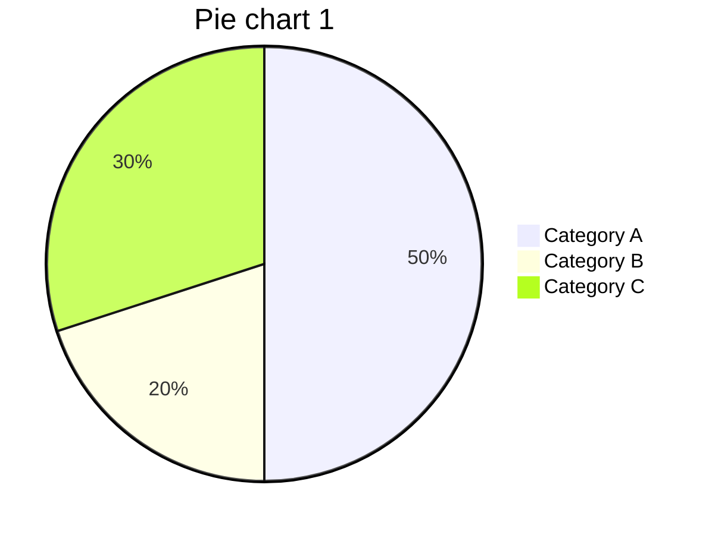

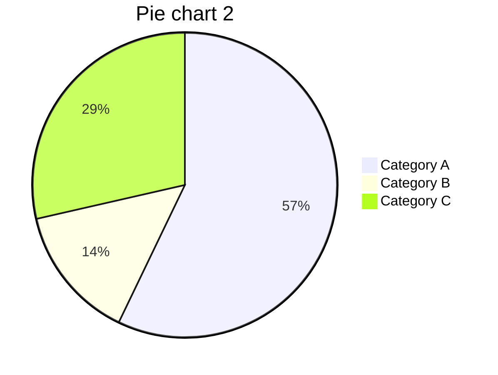
## Sankey chart
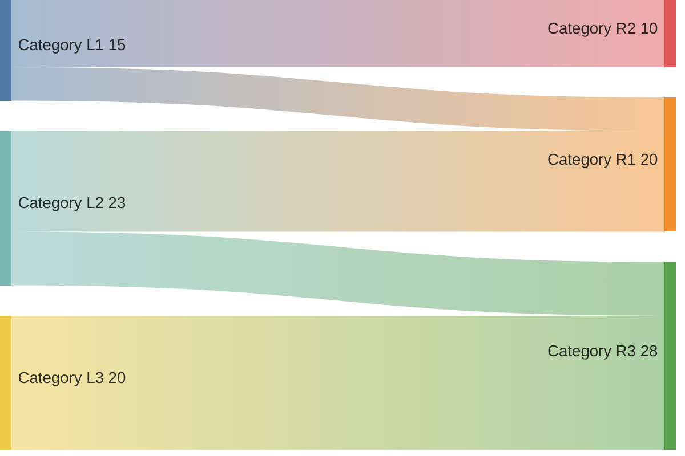

## Enterprise relationship diagram
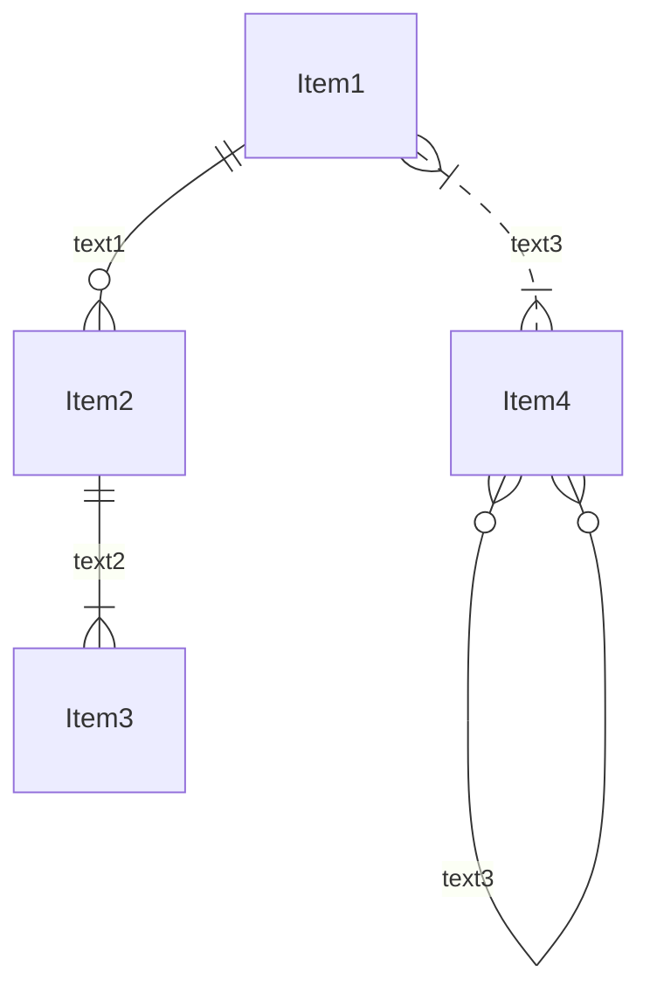
