# Mermaid chart examples

## Flow chart
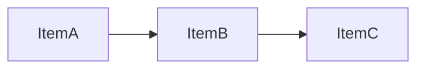

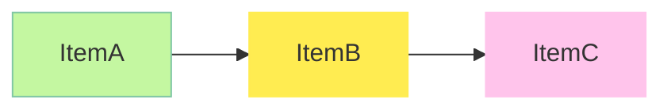

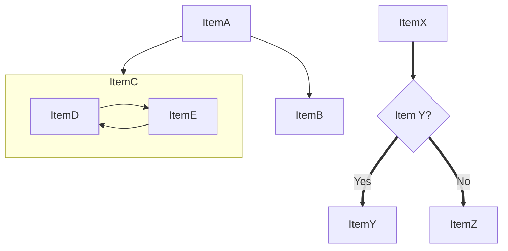

## Pie chart
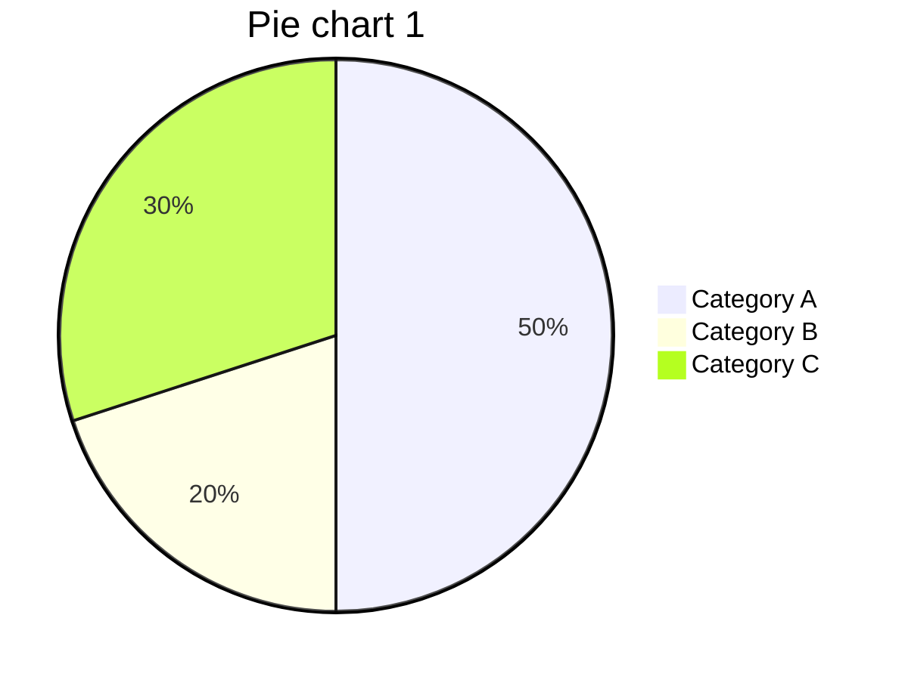

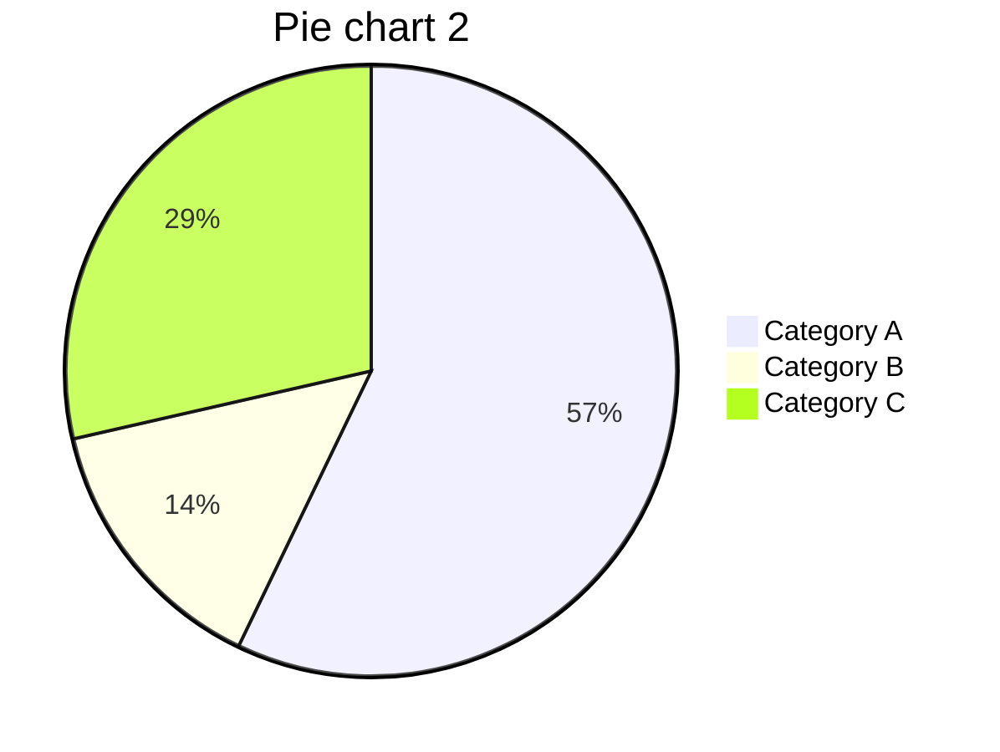

## XY chart
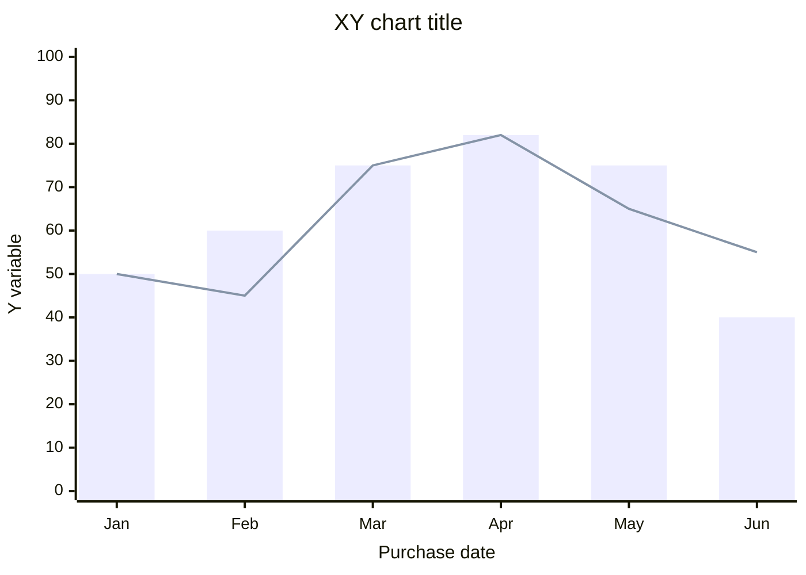

## Sankey chart
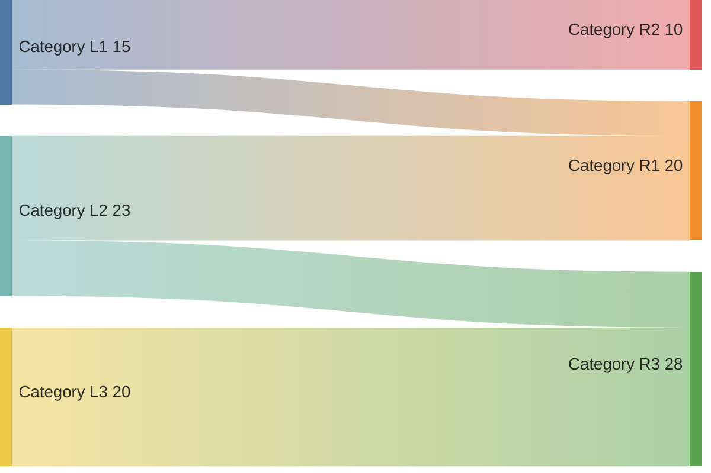

## Quadrant chart
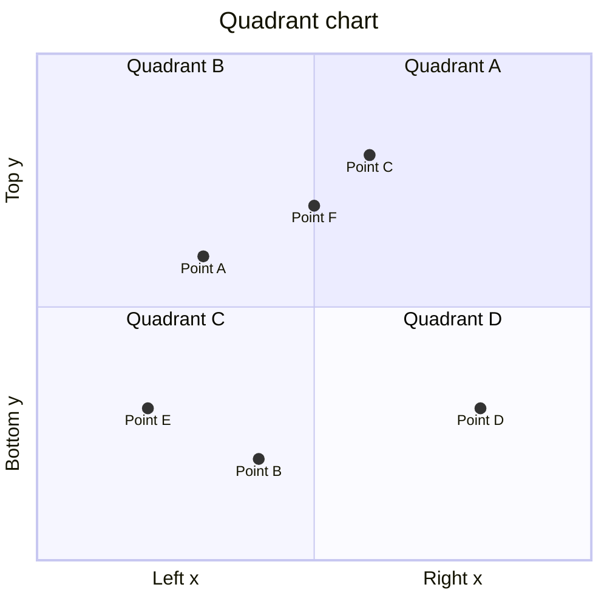

## Timeline
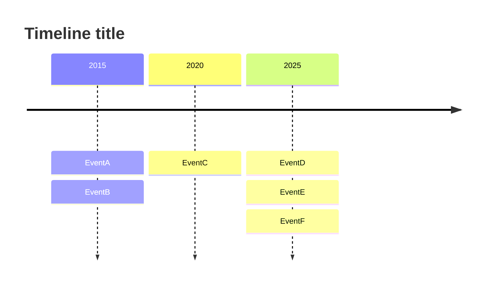

## Gantt chart
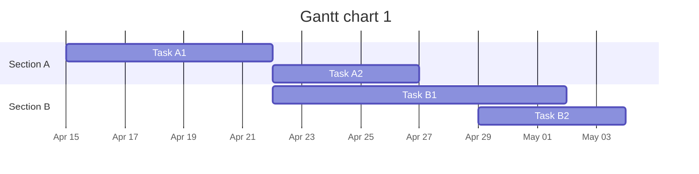

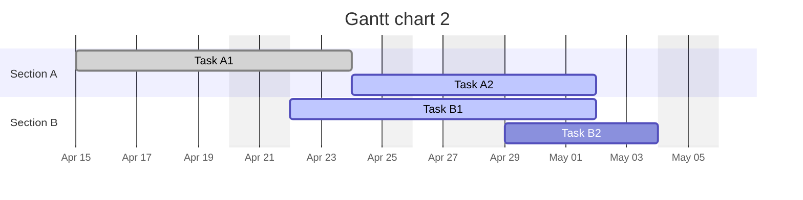

## Journey map
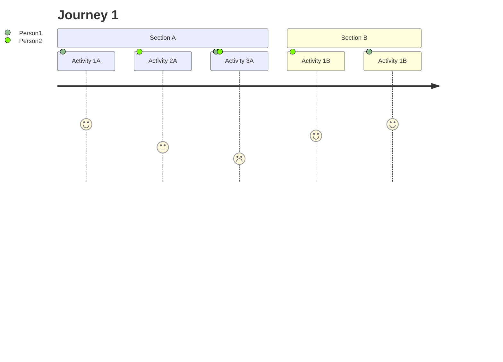

## Mindmap
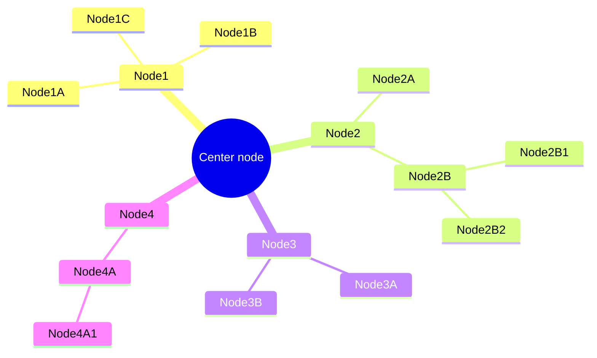

## State diagram
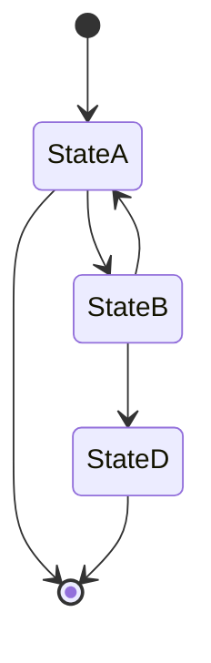

## Sequence chart
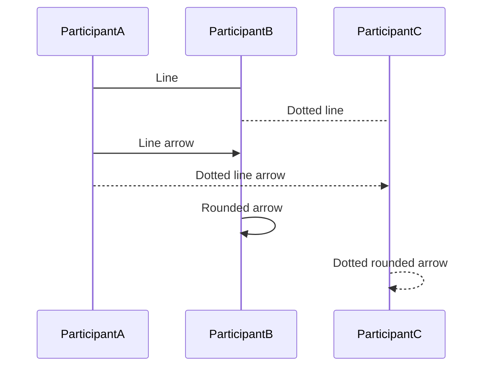

### Use alias and autonumber
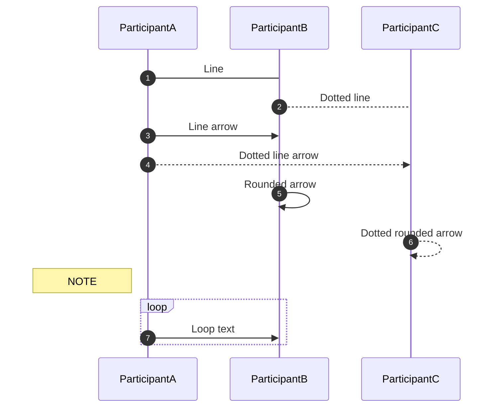

## Enterprise relationship diagram
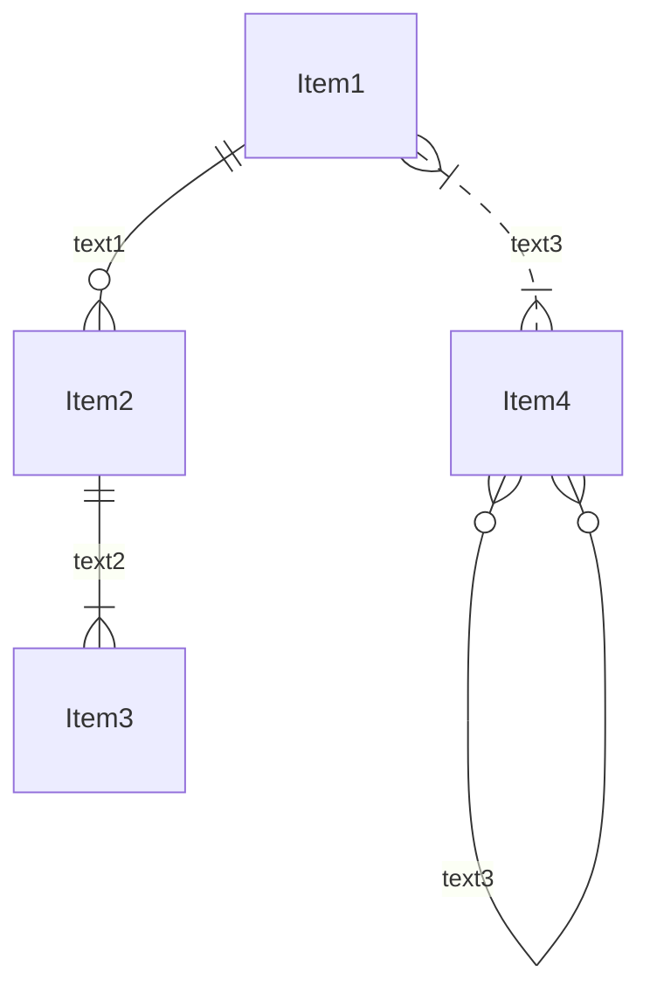

## Class chart
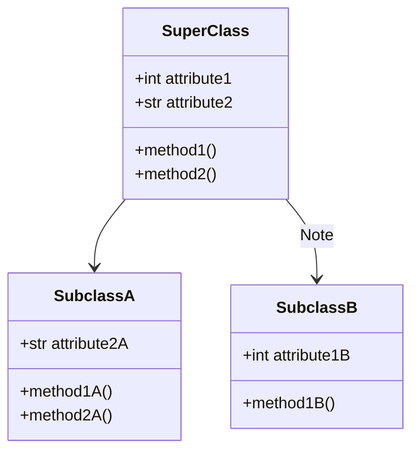
